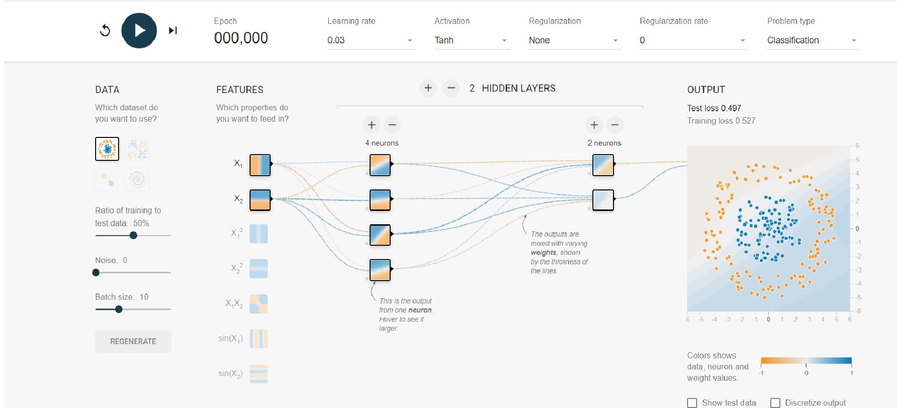

# Hello-Tensorflow

This are some notebooks that I have created and collected  for conducting workshops and bootcamps for beginners in AI.

 - Materials for Tensorflow beginners [Let's GO...](https://tfindiamooc.github.io/) (Practical ML with Tensorflow 2.0)

 - Have fun with Nueral Network [plaground](https://playground.tensorflow.org/#activation=tanh&batchSize=10&dataset=circle&regDataset=reg-plane&learningRate=0.03&regularizationRate=0&noise=0&networkShape=4,2&seed=0.68113&showTestData=false&discretize=false&percTrainData=50&x=true&y=true&xTimesY=false&xSquared=false&ySquared=false&cosX=false&sinX=false&cosY=false&sinY=false&collectStats=false&problem=classification&initZero=false&hideText=false) (A nice tool to visualize and understand the working of nueral networks - **No coding required**)
 
 
